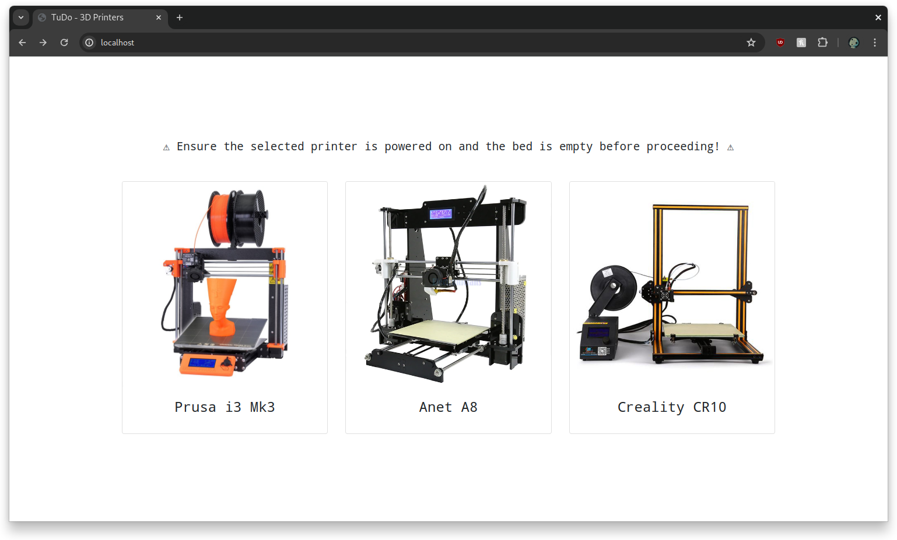

# Octoprint Hub

A simple web interface to list all of our Octoprint instances.



## Configuration

To add or remove a octoprint instance, simply edit the [`hub.ini`](hub.ini) file.

Here's an example entry for the Prusa i3 MK3:
    
```ini
[i3mk3]
Name = Prusa i3 Mk3
Image = images/prusa_i3_mk3.png
Link = 192.168.0.30:8020
Fallback = 10.8.0.1:8020
```

Most of the fields in the configuration are straightforward. The `Fallback` field specifies an alternative URL to redirect to if the primary URL is unavailable. In this example, `10.8.0.1` is used as it represents our server's address when connected to its VPN.

## Running

The hub is intended to be run as a Docker container. To build the container, run the following command:

```bash
docker build -t octoprint-hub .
```

To run the container, use the following command:

```bash
docker run -d -p HOST_PORT:80
```

Where `HOST_PORT` is the port you want to expose the hub on.