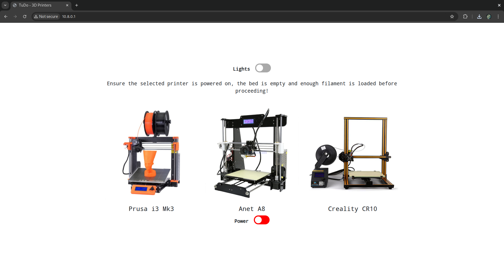
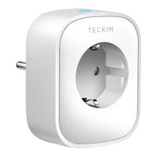

# Octoprint Hub <!-- omit in toc -->

A simple web interface that displays all of our OctoPrint instances and lets us power the lights and printers on or off via tuya "Smart" outlets.



## Table of Contents <!-- omit in toc -->

- [Configuration](#configuration)
  - [Light](#light)
  - [Printers](#printers)
- [Running](#running)
- [Smart Outlets](#smart-outlets)
  - [Extracting the Local Key](#extracting-the-local-key)
  - [Blocking Internet Access](#blocking-internet-access)

## Configuration

The hub is configured via the [`hub.ini`](hub.ini) file which will contain entries for each OctoPrint instance and optionally a light. Each octoprint instance can additionally be assigned a smart outlet to control its power. For more information about the smart outlets and how to set them up, see the [Smart Outlets](#smart-outlets) section.

### Light

The light entry is optional and will create a button on the hub that can be used to toggle the light on or off. Here's an example entry for the light:

```ini
[light]
outlet_ip = 192.168.0.110
outlet_id = bfaac603d066f7754fcmzs
outlet_local_key = SECRET
```

> **For TuDo members:** You can find the IP addresses, IDs, and local keys for our outlets in the [configs](https://github.com/tudo-makerspace/configs) repository.


### Printers

Each printer entry will create a card on the hub that displays the printer's name, a thumbnail image, and optionally a power button if a smart outlet is assigned to the printer. Here's an example entry for a printer:
    
```ini
[anet_a8]
Name = Anet A8
Image = images/anet_a8.png
Link = 10.8.0.1:8021
outlet_ip = 192.168.0.111
outlet_id = bfddc83f322b923233voxl
outlet_local_key = SECRET
```

The outlet values are optional. If omitted, the printer card will not have a power button.

## Running

The hub is intended to be run as a Docker container. To build the container, run the following command:

```bash
docker build -t octoprint-hub .
```

To run the container, use the following command:

```bash
docker run -d -p HOST_PORT:80 octoprint-hub
```

Where `HOST_PORT` is the port you want to expose the hub on.

## Smart Outlets

The hub uses Tuya smart outlets (specifically, TECKIN SP22) to control the power for lights and printers. Such outlets are oftem inexpensive and readily available secondhand. Older SP22 models include an ESP8266 chip that can be flashed with custom firmware, but newer ones use a Realtek chip and are locked to Tuya’s firmware. Unfortunately, our units are of the latter type.

<p align="center">
  
</p>

Tuya’s firmware can be cumbersome, since it requires installing their app and creating an account to configure each device. In addition, communication is encrypted using a unique local key. The good news is that you can extract this local key, which then lets you control your outlets locally (e.g. via [tinytuya](https://github.com/jasonacox/tinytuya)) and no longer depend on Tuya’s cloud or app. The smart devices can then also operate without an internet connection.

> **For TuDo members:**: We've already extracted the local keys for our outlets and stored them in the [configs](www.github.com/tudo-makerspace/configs) repository. You will also be able to find a burner account for the Tuya app and Tuya Developer Platform should you need to reconfigure the outlets.

### Extracting the Local Key

Extracting the local key(s) is pretty cumbersome, as it requires creating a Tuya Developer account, linking your Smart Life account, and using the Tuya API to query the local key. The good news is that all of this only needs to be done once. After that, you can control your outlets locally without needing to use the Tuya app or cloud services.

> Note: There are ways to extract local keys from the tuya "SmartLife" app directly, but those typically require a rooted phone or debug build of the app.

A video tutorial on how to extract the local key(s) can be found [here](https://www.youtube.com/watch?v=Q1ZShFJDvE0&t=348s&pp=ygUSdHV5YSBnZXQgbG9jYWwga2V5).

Alternatively, here's a step-by-step guide based on the [tinytuya README](https://github.com/jasonacox/tinytuya):

- **PAIR**: Download the Smart Life App or Tuya Smart App (available for iPhone or Android).  
Set up your SmartLife account and **pair all of your Tuya devices** (this is important because you cannot access a device that has not been paired). **Do not** use a “guest” account. We recommend setting up a burner account using a temporary email address.

- **TUYA ACCOUNT**:
    1. Create a Tuya Developer account on [iot.tuya.com](https://iot.tuya.com).  
        - When asked for the *Account Type*, select "Skip this step...".  
    2. Click on the "Cloud" icon → "Create Cloud Project".  
        - Pick the correct Data Center *Region* for your location ([check here](#) to find your Region). This will be used by TinyTuya Wizard.  
        - Skip the configuration wizard.
    3. Click on the "Cloud" icon → Select your project → *Devices* → *Link Tuya App Account*.  
    4. Click *Add App Account* (screenshot). A "Link Tuya App Account" dialog will pop up.  
        - Choose "Automatic" and "Read Only Status" (it will still allow commands). Click OK and it will display a QR code.  
        - Scan the QR code with the Smart Life app on your phone by going to the "Me" tab in the Smart Life app and tapping the QR code button `[...]` in the upper-right corner of the app.  
        - When you scan the QR code, it will link all of the devices registered in your Smart Life app into your Tuya IoT project.  
        - If the QR code will not scan, make sure to disable any browser theming plug-ins (such as Dark Reader) and try again.  
    5. No Devices?  
        - If no devices show up after scanning the QR code, you may need to select a different data center and edit your project (or create a new one) until you see your paired devices from the Smart Life App appear.
        - *Note:* The data center may not be the most logical one based on your location. For example, some users in the UK have needed to select "Central Europe" instead of "Western Europe."

- **SERVICE API**: Under the *Service API* tab, click *Go to Authorize* and subscribe to the *IoT Core* service
    > **Important:** Disable popup blockers, or subscribing might fail without indication.

- **OBTAINING THE LOCAL KEY**:
    1. In the *Devices* section, copy the *Device ID* of the device whose local key you want to extract.
    2. In the Sidebar, navigate to *Could* -> *API Explorer*
    3. From there, navigate to *Device Management* -> *Query Device Details in Bulk* and paste the *Device ID* into the `device_ids` field.
    4. Click *Submit Request*. The local key will be displayed in the response JSON.

### Blocking Internet Access

This step is optional but recommended. Once you have extracted the local keys, the outlets no longer require internet access to be operated. You will want to disable their internet access in your router settings. The way to do this will differ from router to router. For instance, we found it easiest to use the Parental Controls feature on our router.
